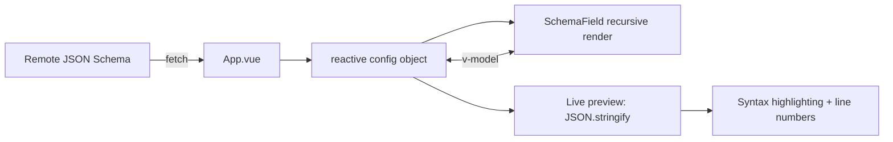

# Fastfetch Config Editor

[](https://fastfetch-cli.github.io/fastfetch-config/)
[](https://github.com/fastfetch-cli/fastfetch-config/actions/workflows/deploy.yml)

A visual configuration editor for [Fastfetch](https://github.com/fastfetch-cli/fastfetch) — inspect, tweak, and generate `config.jsonc` through a graphical interface without writing a single line of JSON by hand.

## Disclaimer

This project is fully AI generated and barely‌ tested. Bugs are expected.

## Overview

Fastfetch is a cross-platform system information tool. Its configuration file uses the JSONC format, with every available setting defined by a canonical JSON Schema. This project fetches that schema live from the official Fastfetch repository and renders it into a three-panel editing experience modelled after the VS Code Settings UI — what you see is what you get.

## Features

- **Dynamic JSON Schema forms** — parses Fastfetch's schema and recursively renders type-appropriate form controls
- **Three-panel layout** — sidebar navigation, settings editor, and live JSONC preview
- **Comprehensive schema support** — objects (collapsible nested properties), arrays (add/remove/reorder), enum select boxes, boolean toggles, numeric and text inputs
- **`oneOf` / `anyOf` variant switching** — automatically detects branching schemas, switches between variants, and inherits correct defaults
- **`$ref` resolution** — resolves internal schema references recursively against the root schema
- **Module manager** — purpose-built for Fastfetch's `modules` array; search, add, delete, reorder, collapse, and convert between string-mode and object-mode
- **Import & export** — import existing `.json` / `.jsonc` files, download a syntax-highlighted `config.jsonc`
- **Markdown rendering** — schema `description` fields support Markdown via `marked`
- **JSONC syntax highlighting** — the live preview pane highlights properties, strings, numbers, literals, and punctuation
- **Dark & light theme** — automatically adapts to the system color scheme
- **Responsive layout** — optimized for desktop, tablet, and mobile breakpoints

## Tech Stack

| Category         | Tools                                                            |
| ---------------- | ---------------------------------------------------------------- |
| Framework        | Vue 3 (`<script setup>` + TypeScript)                            |
| Build tool       | Vite 8                                                           |
| Language         | TypeScript ~6.0                                                  |
| Styling          | SCSS / Sass                                                      |
| Key dependencies | `jsonc-parser` (JSONC parsing), `marked` (Markdown rendering)    |
| Type checking    | vue-tsc                                                          |

## Getting Started

```bash
# Install dependencies
pnpm install

# Start the development server
pnpm dev

# Build for production
pnpm build

# Preview the production build
pnpm preview
```

## Project Structure

```
src/
├── main.ts                          # Application entry point
├── App.vue                          # Main shell: three-panel layout, module management, import/export
├── style.scss                       # Global styles & CSS custom properties
├── components/
│   ├── SchemaField.vue              # Core recursive component: JSON Schema → form controls
│   └── MarkdownDescription.vue      # Markdown renderer wrapping `marked`
```

## Architecture

### 1. Data Flow



### 2. SchemaField Recursive Component

`SchemaField.vue` is the heart of the editor. It accepts any JSON Schema node and maps its `type` and structural features to the appropriate form control:

| Schema trait                       | Rendered control                                      |
| ---------------------------------- | ----------------------------------------------------- |
| `oneOf` / `anyOf` (no `const`)     | Variant picker — switches the entire sub-form         |
| `type: "object"` or `properties`   | Collapsible property list with add/remove support     |
| `type: "array"`                    | Array editor with add/remove, each item recursed      |
| `enum`                             | Select box                                            |
| `type: "boolean"`                  | Toggle switch                                         |
| `type: "number"` / `"integer"`     | Numeric input                                         |
| Everything else                    | Text input                                            |

Key design decisions:

- **Depth tracking** via `props.depth` controls indentation and CSS nesting class
- **Property collapsing** uses a `Set<string>` (`collapsedProperties`) — lightweight, O(1) lookup
- **Smart defaults** — `defaultValue()` inspects the schema (e.g. `default`, `minimum`, `type`) to produce a sensible starting value

### 3. Module Manager

Fastfetch's `modules` array is the most complex part of the configuration: each element's structure depends on its `type`. `App.vue` implements a dedicated module-management layer:

- **Module type selection** — extracts available modules from `items.anyOf[0].oneOf`, with real-time search filtering
- **Reordering** — up / down buttons rearrange modules within the array via splice
- **String mode** — uncustomized modules are stored as plain strings, keeping configs concise
- **Object mode** — clicking "Customize" promotes a string module to a full object, exposing the complete sub-schema form
- **Collapse** — individual module cards can be collapsed to keep long lists manageable

### 4. Configuration Lifecycle

| Phase   | Implementation                                                              |
| ------- | --------------------------------------------------------------------------- |
| **New** | Resets the reactive config, preserving only the `$schema` reference         |
| **Import** | Uses `jsonc-parser` to parse the selected `.jsonc` file, merging into the current config |
| **Edit** | SchemaField binds bidirectionally to the reactive config object — changes appear instantly |
| **Export** | Serialises the config with `JSON.stringify`, wraps it in a JSONC template (with `// Generated` header), and triggers a Blob download |

## License

MIT
